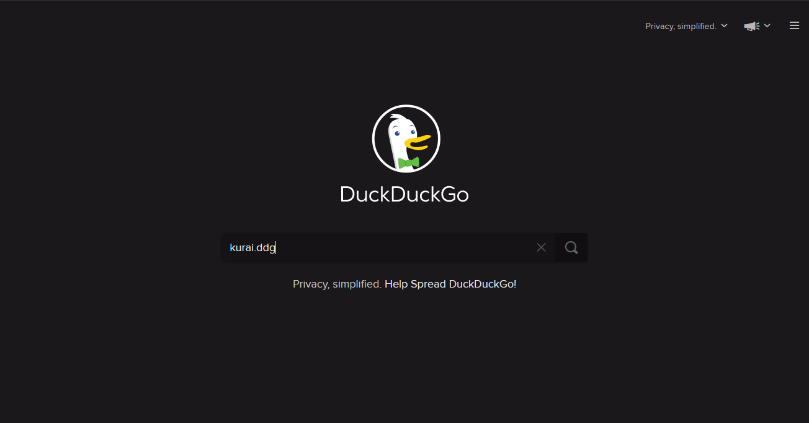
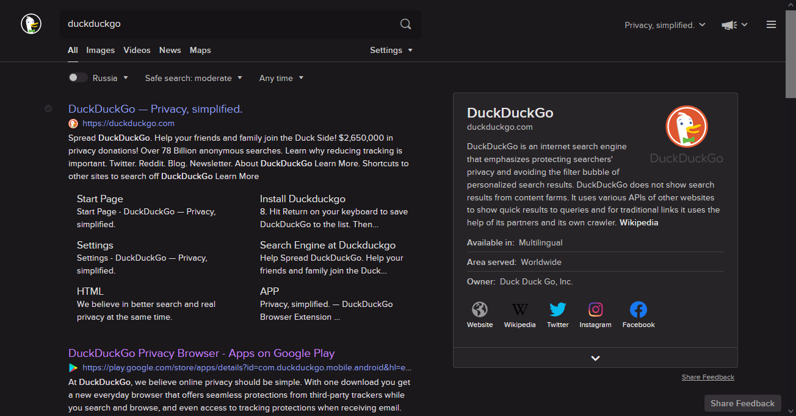

# kurai.ddg
dark colorscheme for [duckduckgo](https://duckduckgo.com)

# usage

**WARNING: loading this theme will override your current settings. Use with caution.**

1. Visit [Settings tab](https://duckduckgo.com/settings).
2. Click on `Load Settings`.
3. Enter `kurai.ddg` as a passphrase`
4. Click on `Disable`. (loaded settings will be saved on your machine, but won't be saved to the cloud with used passphrase)

# Changed settings
- Background Color - `#1a181b`
- Header Color - `#1a181b`
- Title Color - `#ca80ff`
- Visited Title Color - `#8f9fef`
- Snippet Color - `#e9e2e9`
- URL Color - `#8f9fef`
- Hover, Module and Dropdown Background - `#272428`
